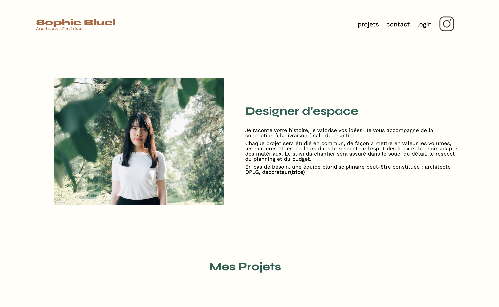

# 🎨 Sophie Bluel

<p align="center">
  
</p>

<p align="center">


</p>

---

# 📖 À propos

**Sophie Bluel** est le deuxième projet réalisé dans le cadre de la formation **Développeur Web OpenClassrooms**.

L'objectif était de développer la partie dynamique d'un site existant pour une architecte d'intérieur en utilisant **JavaScript** et une **API REST**.

Le projet consiste à récupérer les données depuis une API, afficher dynamiquement les réalisations, mettre en place une authentification administrateur et permettre la gestion complète de la galerie.

Remarque : Dans le cadre de ce projet, le backend était fourni. Mon travail a porté sur le développement de la partie front-end, l'intégration avec l'API REST, l'authentification administrateur et les fonctionnalités de gestion de la galerie.

---

# 🎯 Objectifs

- Consommer une API REST.
- Manipuler le DOM avec JavaScript.
- Mettre en place une authentification.
- Gérer le stockage du token utilisateur.
- Ajouter et supprimer des projets sans recharger la page.
- Créer une interface d'administration.

---

# 📂 Structure du projet

```text
Portfolio-architecte-sophie-bluel-master/
│
├── assets/                         # Images utilisées dans le portfolio.json
│   ├── add-project.png
│   ├── book.png
│   ├── gallery.png
│   ├── login.png
│   ├── logo.png
│   ├── modal.png
│   └── preview.png
│
├── FrontEnd/
│   ├── assets/
│   │   ├── icons/
│   │   ├── images/
│   │   ├── login.css
│   │   ├── modal.css
│   │   └── style.css
│   │
│   ├── js/
│   │   ├── homepage.js
│   │   ├── login.js
│   │   └── modal.js
│   │
│   ├── index.html
│   └── login.html
│
├── Backend/
│   ├── config/
│   │   └── db.config.js
│   │
│   ├── controllers/
│   │   ├── categories.controller.js
│   │   ├── users.controller.js
│   │   └── works.controller.js
│   │
│   ├── middlewares/
│   │   ├── auth.js
│   │   ├── checkWork.js
│   │   └── multer-config.js
│   │
│   ├── models/
│   │   ├── categories.model.js
│   │   ├── users.model.js
│   │   ├── works.model.js
│   │   └── index.js
│   │
│   ├── routes/
│   │   ├── categories.routes.js
│   │   ├── user.routes.js
│   │   └── works.routes.js
│   │
│   ├── images/
│   ├── database.sqlite
│   ├── swagger.yaml
│   ├── app.js
│   ├── server.js
│   ├── package.json
│   ├── package-lock.json
│   └── README.md
│
├── portfolio.json
├── package-lock.json
└── README.md
```

## Pour le lancer le code
### Backend
Ouvrir le dossier Backend et lire le README.md

### Frontend
Ouvrir le dossier Frontend et lancer liveserver de votre IDE
 
## Astuce
 
Si vous désirez afficher le code du backend et du frontend, faites le dans 2 instances de VSCode différentes pour éviter tout problème

---

# ✨ Fonctionnalités

- 🖼️ Galerie dynamique
- 🏷️ Filtrage des réalisations
- 🔐 Connexion administrateur
- ➕ Ajout d'un projet
- ❌ Suppression d'un projet
- 📤 Envoi d'images vers l'API
- ⚡ Mise à jour instantanée de la galerie
- 📱 Interface responsive

---

# 🛠️ Technologies utilisées

- HTML5
- CSS3
- JavaScript (ES6)
- Fetch API
- API REST
- Git
- GitHub

---

# 🎯 Compétences développées

Au cours de ce projet, j'ai appris à :

- Communiquer avec une API REST
- Utiliser Fetch et les requêtes HTTP
- Manipuler le DOM de manière dynamique
- Gérer l'authentification avec JWT
- Utiliser le Local Storage
- Développer une interface d'administration
- Envoyer des fichiers via FormData
- Organiser un projet JavaScript

---

# 🔐 Authentification

L'espace administrateur permet :

- Connexion sécurisée
- Gestion des projets
- Ajout d'images
- Suppression de réalisations
- Déconnexion

---

# 🌐 API REST

Endpoints utilisés :

| Méthode | Endpoint | Description |
|---------|----------|-------------|
| GET | `/api/works` | Liste des réalisations |
| GET | `/api/categories` | Liste des catégories |
| POST | `/api/users/login` | Authentification |
| POST | `/api/works` | Ajouter une réalisation |
| DELETE | `/api/works/:id` | Supprimer une réalisation |

---

# ♿ Accessibilité

Le projet respecte les bonnes pratiques :

- HTML sémantique
- Labels associés aux formulaires
- Images alternatives
- Navigation clavier
- Gestion des états de connexion

---

# 🚀 Performances

Optimisations réalisées :

- Chargement dynamique des données
- Manipulation efficace du DOM
- Rechargement partiel de la galerie
- Utilisation de Fetch API
- Code JavaScript modulaire

---

# 🔗 Liens

### 📂 Repository

https://github.com/MohamedZem/Sophie_Bluel

---

# 👨‍💻 Auteur

**Mohamed Zemouchi**

- 🌐 Portfolio : https://www.mohamedzemouchi.fr
- 💼 LinkedIn : https://www.linkedin.com/in/ton-profil
- 💻 GitHub : https://github.com/MohamedZem